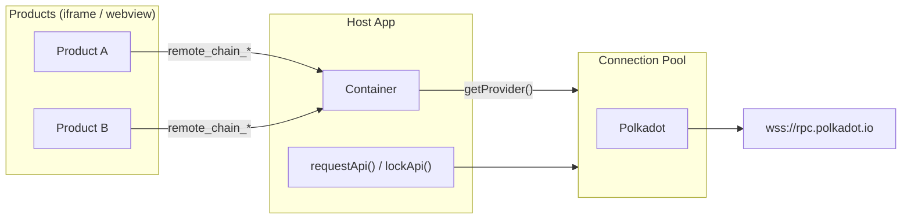

# @novasamatech/host-substrate-chain-connection

Reference-counted connection pool for [polkadot-api](https://github.com/polkadot-api/polkadot-api). Connections are created on first use, shared across callers, and destroyed when the last caller releases them.

- **Shared connections** - one underlying WebSocket (or light client) per chain, multiplexed across consumers
- **Automatic lifecycle** - ref-counted; opens on first acquire, closes when the last caller releases
- **Flexible resolution** - transform the raw `PolkadotClient` into any app-specific type via `resolve`
- **Metadata caching** - optional persistent cache so `polkadot-api` skips re-fetching metadata on reconnect
- **Status tracking** - subscribe to per-chain connection status changes

## Install

```bash
npm install @novasamatech/host-substrate-chain-connection
```

## Quick start

```ts
import {
  createChainConnection,
  createWsJsonRpcProvider,
  type ChainConfig,
} from '@novasamatech/host-substrate-chain-connection';
import { dot } from '@polkadot-api/descriptors';

const polkadot: ChainConfig = {
  chainId: '0x91b171bb158e2d3848fa23a9f1c25182fb8e20313b2c1eb49219da7a70ce90c3',
  nodes: [{ url: 'wss://rpc.polkadot.io' }],
};

const chains = createChainConnection({
  createProvider: (chain, onStatusChanged) =>
    createWsJsonRpcProvider({
      endpoints: chain.nodes.map((n) => n.url),
      onStatusChanged,
    }),
});

// One-shot query - connection is acquired and released automatically
const account = await chains.requestApi(polkadot, async (client) => {
  const api = client.getTypedApi(dot);
  return api.query.System.Account.getValue('5GrwvaEF...');
});
```

## Table of contents

- [API](#api)
  - [`createChainConnection`](#createchainconnectionconfig)
  - [`requestApi`](#requestapichain-callback)
  - [`lockApi`](#lockapichain)
  - [`getProvider`](#getproviderchain)
  - [`status` / `onStatusChanged`](#statuschainid--onstatuschangedchainid-callback)
  - [`createWsJsonRpcProvider`](#createwsjsonrpcprovideroptions)
  - [`createMetadataCache`](#createmetadatacacheoptions)
- [Recipes](#recipes)
  - [Custom resolve](#custom-resolve)
  - [Metadata caching](#metadata-caching)
  - [Smoldot light client](#smoldot-light-client)
  - [Multiple chains](#multiple-chains)
  - [Raw JSON-RPC subscriptions](#raw-json-rpc-subscriptions)
- [How it works](#how-it-works)
- [Full example](#full-example)

## API

### `createChainConnection(config)`

Creates a connection pool. Generic over your chain config `C` and resolved API type `T`.

```ts
function createChainConnection<C extends ChainConfig, T = PolkadotClient>(
  config: ChainConnectionConfig<C, T>,
): ChainConnection<C, T>;
```

**`ChainConnectionConfig<C, T>`**

| Field | Type | Description |
|---|---|---|
| `createProvider` | `(chain: C, onStatusChanged: (status: ConnectionStatus) => void) => JsonRpcProvider` | Factory for the underlying JSON-RPC transport. Called once per chain. Use `onStatusChanged` to feed connection status back into the pool. |
| `clientOptions` | `(chain: C) => ClientOptions` | Optional. Returns [polkadot-api client options](https://papi.how/) - typically metadata cache hooks (`getMetadata` / `setMetadata`). |
| `resolve` | `(chain: C, client: PolkadotClient) => Promise<T>` | Optional. Transforms the raw `PolkadotClient` into your app's API type. The result is cached per chain. If omitted, `T` defaults to `PolkadotClient`. |

**`ChainConfig`** - minimum shape your chain objects must satisfy:

```ts
type ChainConfig = {
  chainId: string;
  nodes: ReadonlyArray<{ url: string }>;
};
```

Returns a [`ChainConnection<C, T>`](#requestapichain-callback) with the methods below.

---

### `requestApi(chain, callback)`

Acquires a connection, runs the callback, and releases automatically when it settles. Best for one-shot queries.

**Signature:**

```ts
requestApi<Return>(chain: C, callback: (api: T) => Return): Promise<Awaited<Return>>
```

**Example:**

```ts
const account = await chains.requestApi(polkadot, async (client) => {
  const api = client.getTypedApi(dot);
  return api.query.System.Account.getValue('5GrwvaEF...');
});
```

---

### `lockApi(chain)`

Acquires a connection and holds it until `unlock()` is called. Use for subscriptions or multi-step flows where you need the connection to stay alive.

**Signature:**

```ts
lockApi(chain: C): Promise<{ api: T; unlock: VoidFunction }>
```

**Example:**

```ts
const { api: client, unlock } = await chains.lockApi(polkadot);

try {
  const api = client.getTypedApi(dot);

  const sub = api.query.System.Account.watchValue('5GrwvaEF...').subscribe({
    next: (value) => console.info('Balance:', value.data.free),
  });

  // later...
  sub.unsubscribe();
} finally {
  unlock();
}
```

---

### `getProvider(chain)`

Returns a `JsonRpcProvider` backed by the shared pooled connection. The provider holds a ref-counted branch - the underlying connection opens when the provider starts and closes when `disconnect()` is called.

Useful for passing a provider to an iframe, webview, or any library that expects a raw `JsonRpcProvider`.

**Signature:**

```ts
getProvider(chain: C): JsonRpcProvider
```

**Example:**

```ts
const provider = chains.getProvider(polkadot);
// Connection is released when the consumer calls disconnect()
```

---

### `status(chainId)` / `onStatusChanged(chainId, callback)`

Read or subscribe to connection status. Both take a `chainId` string (the genesis hash). Returns `'disconnected'` for chains that have never been connected.

**Signature:**

```ts
status(chainId: string): ConnectionStatus
// ConnectionStatus = 'connecting' | 'connected' | 'disconnected'

onStatusChanged(chainId: string, callback: (status: ConnectionStatus) => void): VoidFunction
```

**Example:**

```ts
const currentStatus = chains.status(polkadot.chainId);

const unsubscribe = chains.onStatusChanged(polkadot.chainId, (status) => {
  console.info('Polkadot:', status);
});

// Stop listening:
unsubscribe();
```

---

### `createWsJsonRpcProvider(options)`

WebSocket provider factory. Wraps polkadot-api's `getWsProvider` with `polkadot-sdk-compat` and translates WebSocket events to `ConnectionStatus`. Active JSON-RPC subscriptions are automatically replayed after a reconnect — consumers using `getProvider` don't need to handle reconnects manually.

**Signature:**

```ts
function createWsJsonRpcProvider(options: {
  endpoints: string[];
  onStatusChanged?: (status: ConnectionStatus) => void;
}): JsonRpcProvider;
```

**Example:**

```ts
const provider = createWsJsonRpcProvider({
  endpoints: ['wss://rpc.polkadot.io', 'wss://polkadot-rpc.dwellir.com'],
  onStatusChanged: (status) => console.info(status),
});
```

---

### `createMetadataCache(options)`

Caches chain metadata in memory, with optional persistence via a `StorageAdapter`. Wire it into `clientOptions` so polkadot-api skips re-fetching metadata on reconnect.

**Signature:**

```ts
function createMetadataCache(options?: { storage?: StorageAdapter }): MetadataCache;

type MetadataCache = {
  forChain(chainId: string): ClientOptions;
};
```

`forChain` returns an object with `getMetadata` / `setMetadata` methods that polkadot-api's `createClient` accepts as its second argument.

**Example:**

```ts
import { createMetadataCache } from '@novasamatech/host-substrate-chain-connection';
import { createLocalStorageAdapter } from '@novasamatech/storage-adapter';

// In-memory only
const cache = createMetadataCache();

// With localStorage persistence (survives page reloads)
const cache = createMetadataCache({
  storage: createLocalStorageAdapter('chain-metadata'),
});
```

## Recipes

### Custom resolve

The `resolve` callback transforms the raw `PolkadotClient` into whatever your app needs. The result is cached per chain and shared across all callers.

```ts
import { type PolkadotClient, type TypedApi } from 'polkadot-api';
import { dot, type DotDescriptor } from '@polkadot-api/descriptors';

type ResolvedApi = {
  api: TypedApi<DotDescriptor>;
  client: PolkadotClient;
};

const chains = createChainConnection<ChainConfig, ResolvedApi>({
  createProvider: (chain, onStatusChanged) =>
    createWsJsonRpcProvider({
      endpoints: chain.nodes.map((n) => n.url),
      onStatusChanged,
    }),

  resolve: async (_chain, client) => ({
    api: client.getTypedApi(dot),
    client,
  }),
});

// Now requestApi and lockApi return ResolvedApi instead of PolkadotClient
const account = await chains.requestApi(polkadot, async ({ api }) => {
  return api.query.System.Account.getValue('5GrwvaEF...');
});
```

---

### Metadata caching

```ts
import { createLocalStorageAdapter } from '@novasamatech/storage-adapter';

const metadataCache = createMetadataCache({
  storage: createLocalStorageAdapter('chain-metadata'),
});

const chains = createChainConnection({
  createProvider: (chain, onStatusChanged) =>
    createWsJsonRpcProvider({
      endpoints: chain.nodes.map((n) => n.url),
      onStatusChanged,
    }),
  clientOptions: (chain) => metadataCache.forChain(chain.chainId),
});
```

---

### Smoldot light client

Smoldot syncs chain state directly in the browser without trusting a remote RPC node. It works for well-known relay chains (Polkadot, Kusama, Westend) - parachains fall back to WebSocket.

```ts
import { type JsonRpcProvider } from '@polkadot-api/json-rpc-provider';
import { getSmProvider } from 'polkadot-api/sm-provider';
import { type Client as SmoldotClient, start as startSmoldot } from 'polkadot-api/smoldot';

type MyChain = ChainConfig & {
  name: string;
  lightClient?: boolean;
};

// Chain specs for each relay chain - polkadot-api ships these built-in.
const lightClientChainSpecs: Record<string, () => Promise<{ chainSpec: string }>> = {
  '0x91b171bb158e2d3848fa23a9f1c25182fb8e20313b2c1eb49219da7a70ce90c3': () => import('polkadot-api/chains/polkadot'),
  '0xb0a8d493285c2df73290dfb7e61f870f17b41801197a149ca93654499ea3dafe': () => import('polkadot-api/chains/ksmcc3'),
  '0xe143f23803ac50e8f6f8e62695d1ce9e4e1d68aa36c1cd2cfd15340213f3423e': () => import('polkadot-api/chains/westend2'),
};

// Smoldot instance is created lazily and shared across all chains.
let smoldot: SmoldotClient | null = null;

const createLightClientProvider = (chain: MyChain): JsonRpcProvider => {
  const getChainSpec = lightClientChainSpecs[chain.chainId];
  if (!getChainSpec) {
    throw new Error(`Light client for chain "${chain.name}" is not supported`);
  }

  const smoldotChain = getChainSpec().then(({ chainSpec }) => {
    if (!smoldot) {
      smoldot = startSmoldot();
    }
    return smoldot.addChain({ chainSpec });
  });

  return getSmProvider(smoldotChain);
};

const chains = createChainConnection<MyChain>({
  createProvider: (chain, onStatusChanged) => {
    if (chain.lightClient && chain.chainId in lightClientChainSpecs) {
      // Light clients report connected immediately - Smoldot handles syncing internally.
      onStatusChanged('connected');
      return createLightClientProvider(chain);
    }

    return createWsJsonRpcProvider({
      endpoints: chain.nodes.map((n) => n.url),
      onStatusChanged,
    });
  },
});
```

---

### Multiple chains

When your app connects to several chains with different descriptors, `resolve` receives the chain object so you can return the right typed API for each.

Common additions beyond `api` and `client`:

- **Pre-resolved `compatibilityToken`** - avoids repeated async lookups at every call site
- **Typed codecs** via `getTypedCodecs(descriptor)` - for encoding/decoding extrinsics without going through the API layer
- **Descriptor key** - a string discriminant so you can narrow the typed API at runtime

```ts
import { dot, ksm, type DotDescriptor, type KsmDescriptor } from '@polkadot-api/descriptors';
import { type ChainDefinition, type CompatibilityToken, type TypedApi, getTypedCodecs } from 'polkadot-api';

const descriptorMap: Record<string, ChainDefinition> = {
  [polkadot.chainId]: dot,
  [kusama.chainId]: ksm,
};

type ResolvedApi = {
  api: TypedApi<DotDescriptor> | TypedApi<KsmDescriptor>;
  client: PolkadotClient;
  codecs: Awaited<ReturnType<typeof getTypedCodecs>>;
  compatibilityToken: CompatibilityToken;
};

const chains = createChainConnection<MyChain, ResolvedApi>({
  createProvider: (chain, onStatusChanged) =>
    createWsJsonRpcProvider({
      endpoints: chain.nodes.map((n) => n.url),
      onStatusChanged,
    }),

  resolve: async (chain, client) => {
    const descriptor = descriptorMap[chain.chainId];
    const api = client.getTypedApi(descriptor);

    // Pre-resolve once - these require async metadata fetches
    // that you don't want repeated at every call site.
    const [compatibilityToken, codecs] = await Promise.all([
      api.compatibilityToken,
      getTypedCodecs(descriptor),
    ]);

    return { api, client, codecs, compatibilityToken };
  },
});
```

### Raw JSON-RPC subscriptions

`getProvider` returns a raw `JsonRpcProvider`. When used with subscription methods, active subscriptions are automatically resent after a WebSocket reconnect — no manual reconnect handling needed.

```ts
const provider = chains.getProvider(polkadot);

const conn = provider(message => {
  const parsed = JSON.parse(message);
  if (parsed.method === 'chain_newHead') {
    console.info('New head:', parsed.params.result);
  }
});

// Subscribe to new block heads
conn.send(JSON.stringify({ id: 1, method: 'chain_subscribeNewHeads', params: [] }));

// If the WebSocket drops and reconnects, the subscription is automatically
// resent. The server assigns a new subscription ID and notifications resume.

// Cleanup
conn.disconnect();
```

> **Note:** Use the most recently received server-assigned subscription ID when unsubscribing. IDs from before a reconnect are no longer valid.

---

## How it works



Products embedded in iframes or webviews don't connect to RPC nodes directly. They send `remote_chain_*` requests to the **Container**, which obtains a provider from the **Connection Pool** via `getProvider(chain)`.

The host app's own code uses the same pool through `requestApi` and `lockApi`. Everyone shares the same underlying connections - one per chain. The pool opens a connection on first use and closes it when the last consumer releases.

## Full example

Production-grade setup matching the architecture of [polkadot-desktop](https://github.com/paritytech/polkadot-desktop). Includes Smoldot light client fallback, metadata caching, specName-based descriptor resolution, and a rich resolved API type.

```ts
import {
  createChainConnection,
  createMetadataCache,
  createWsJsonRpcProvider,
  type ChainConfig,
} from '@novasamatech/host-substrate-chain-connection';
import { createLocalStorageAdapter } from '@novasamatech/storage-adapter';
import { type JsonRpcProvider } from '@polkadot-api/json-rpc-provider';
import {
  type ChainDefinition,
  type CompatibilityToken,
  type PolkadotClient,
  type TypedApi,
  getTypedCodecs,
} from 'polkadot-api';
import { getSmProvider } from 'polkadot-api/sm-provider';
import { type Client as SmoldotClient, start as startSmoldot } from 'polkadot-api/smoldot';

import { dot, dot_ah, dot_ppl, ksm, ksm_ah, wnd, wnd_ah } from '@polkadot-api/descriptors';

// ---------------------------------------------------------------------------
// 1. Chain config
//
//    Extend ChainConfig with app-specific fields. `specName` is used to
//    select the right descriptor for each chain.
// ---------------------------------------------------------------------------

type Chain = ChainConfig & {
  name: string;
  specName: string;
};

// ---------------------------------------------------------------------------
// 2. Descriptor resolution
//
//    Maps specName → default descriptor, with chainId overrides for
//    parachains that share a specName with their relay chain.
// ---------------------------------------------------------------------------

type Descriptor = { type: string; def: ChainDefinition };

const parachainOverrides: Record<string, Descriptor> = {
  // Polkadot Asset Hub
  '0x68d56f15f85d3136970ec16946040bc1752654e906147f7e43e9d539d7c3de2f': { type: 'dot_ah', def: dot_ah },
  // Polkadot People
  '0x67fa177a097bfa18f77ea95ab56e9bcdfeb0e5b8a40e46298bb93e16b6fc5008': { type: 'dot_ppl', def: dot_ppl },
  // Kusama Asset Hub
  '0x48239ef607d7928874027a43a67689209727dfb3d3dc5e5b03a39bdc2eda771a': { type: 'ksm_ah', def: ksm_ah },
  // Westend Asset Hub
  '0x67f9723393ef76214df0118c34bbbd3dbebc8ed46a10973a8c969d48fe7598c9': { type: 'wnd_ah', def: wnd_ah },
};

const specNameDefaults: Record<string, Descriptor> = {
  polkadot: { type: 'dot', def: dot },
  kusama:   { type: 'ksm', def: ksm },
  westend:  { type: 'wnd', def: wnd },
};

const getDescriptor = (chain: Chain): Descriptor => {
  return parachainOverrides[chain.chainId]
    ?? specNameDefaults[chain.specName]
    ?? { type: 'dot', def: dot };
};

// ---------------------------------------------------------------------------
// 3. Smoldot light client
//
//    Used for relay chains; parachains fall back to WebSocket.
// ---------------------------------------------------------------------------

const lightClientChainSpecs: Record<string, () => Promise<{ chainSpec: string }>> = {
  '0x91b171bb158e2d3848fa23a9f1c25182fb8e20313b2c1eb49219da7a70ce90c3': () => import('polkadot-api/chains/polkadot'),
  '0xb0a8d493285c2df73290dfb7e61f870f17b41801197a149ca93654499ea3dafe': () => import('polkadot-api/chains/ksmcc3'),
  '0xe143f23803ac50e8f6f8e62695d1ce9e4e1d68aa36c1cd2cfd15340213f3423e': () => import('polkadot-api/chains/westend2'),
};

let smoldot: SmoldotClient | null = null;

const createLightClientProvider = (chainId: string): JsonRpcProvider => {
  const getChainSpec = lightClientChainSpecs[chainId]!;

  const smoldotChain = getChainSpec().then(({ chainSpec }) => {
    if (!smoldot) {
      smoldot = startSmoldot();
    }
    return smoldot.addChain({ chainSpec });
  });

  return getSmProvider(smoldotChain);
};

// ---------------------------------------------------------------------------
// 4. Metadata cache
// ---------------------------------------------------------------------------

const metadataCache = createMetadataCache({
  storage: createLocalStorageAdapter('chain-metadata'),
});

// ---------------------------------------------------------------------------
// 5. Resolved API type
//
//    `resolve` pre-computes everything callers need so they don't have to
//    repeat async lookups (compatibilityToken, codecs) at every call site.
// ---------------------------------------------------------------------------

type TypedClient = {
  type: string;
  api: TypedApi<ChainDefinition>;
  codecs: Awaited<ReturnType<typeof getTypedCodecs>>;
  compatibilityToken: CompatibilityToken;
  client: PolkadotClient;
};

// ---------------------------------------------------------------------------
// 6. Create the connection pool
// ---------------------------------------------------------------------------

const chains = createChainConnection<Chain, TypedClient>({
  createProvider: (chain, onStatusChanged) => {
    if (chain.chainId in lightClientChainSpecs) {
      onStatusChanged('connected');
      return createLightClientProvider(chain.chainId);
    }

    return createWsJsonRpcProvider({
      endpoints: chain.nodes.map((n) => n.url),
      onStatusChanged,
    });
  },

  clientOptions: (chain) => metadataCache.forChain(chain.chainId),

  resolve: async (chain, client) => {
    const { type, def } = getDescriptor(chain);
    const api = client.getTypedApi(def);

    const [compatibilityToken, codecs] = await Promise.all([
      api.compatibilityToken,
      getTypedCodecs(def),
    ]);

    return { type, api, codecs, compatibilityToken, client };
  },
});

// ---------------------------------------------------------------------------
// 7. Usage
// ---------------------------------------------------------------------------

const polkadot: Chain = {
  chainId: '0x91b171bb158e2d3848fa23a9f1c25182fb8e20313b2c1eb49219da7a70ce90c3',
  specName: 'polkadot',
  name: 'Polkadot',
  nodes: [{ url: 'wss://rpc.polkadot.io' }, { url: 'wss://polkadot-rpc.dwellir.com' }],
};

// One-shot query
const account = await chains.requestApi(polkadot, async ({ api }) => {
  return api.query.System.Account.getValue('5GrwvaEF...');
});

// Long-lived subscription
const { api: resolved, unlock } = await chains.lockApi(polkadot);

const sub = resolved.api.query.System.Account.watchValue('5GrwvaEF...').subscribe({
  next: (value) => console.info('Balance:', value.data.free),
});

// Cleanup
sub.unsubscribe();
unlock();

// Connection status
const unsubscribe = chains.onStatusChanged(polkadot.chainId, (status) => {
  console.info(`${polkadot.name}:`, status);
});

// Pass provider to an iframe or webview
const provider = chains.getProvider(polkadot);
```
